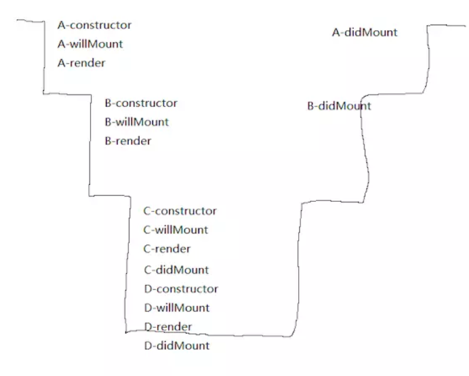
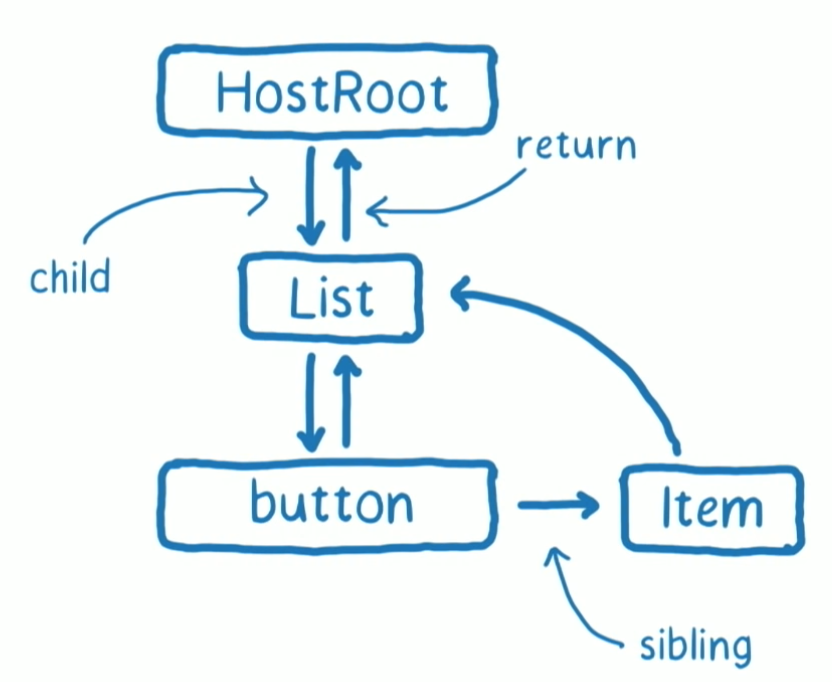
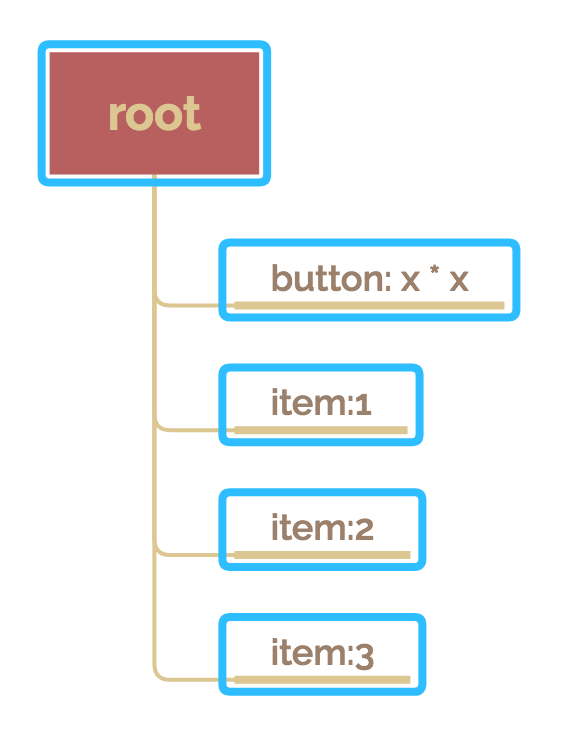
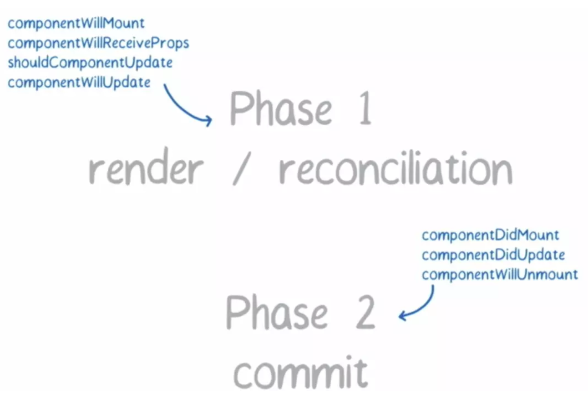

# react异步渲染
## 为什么要有异步渲染？
### react16之前的渲染：
  + 渲染流程：

    create element -> instance -> commit

    根据代码创建每个组件对应的element，根据reconciliation算法diff新旧节点树，不变的clone，更改的更新element，生成新的instance，操作真实的dom进行更新

  + 层级组件渲染顺序：

    例：A -> B -> C、D
    如图：

    

    从顶层开始，以render为界限向下执行子组件渲染，直到最底层的自组件完成整个生命周期之后在逐层向上执行父组件的didmount
    
### 存在的问题：
  + 对于一个庞大的v-dom tree来说，diff算法执行的时间太长的情况下，主线程一直被js占用，任何的交互、渲染都会停止
  + 不是所有的数据更新都需要立即展示，比如屏幕显示之外的更新
  + 理想情况下，高优先级任务的处理应该可以打断低优先级的任务的处理，比如用户输入可打断部分数据更新

## 异步渲染优势以及原理
### 优势：良好的用户体验
### 原理：

  将任务拆分成一个个分片，每个分片执行完之后去检查是否还继续拥有主线程时间片，如果有继续下一个，如果没有则先处理其他高优先级事务，等主线程空闲下来继续执行，每个分片的数据结构即为fiber，在源码里对fiber的解释是“A Fiber is work on a Component that needs to be done or was done. There can be more than one per component”，即代表组件需要做的工作，一个组件对应一个或多个fiber节点。（react16之后的组件实例会生成一个_reactInternalFiber属性指向它对应的Fiber实例）
## Fiber
### fiber节点数据结构

 

  `

      Fiber = {
          tag: TypeOfWork, // fiber的类型，参考最后的tag类型
          alternate: Fiber|null, // 在fiber更新时克隆出的镜像fiber，对fiber的修改会标记在这个fiber上,相当于workInProgress
          return: Fiber|null, // 指向fiber树中的父节点
          child: Fiber|null, // 指向第一个子节点
          sibling: Fiber|null, // 指向兄弟节点
          stateNode:,
          effectTag: TypeOfSideEffect, // side effect类型，下文会介绍
          nextEffect: Fiber | null, // 单链表结构，方便遍历fiber树上有副作用的节点
          pendingWorkPriority: PriorityLevel, // 标记子树上待更新任务的优先级 ？？？？
      }

### 渲染过程：以下图fiber-tree 为例

  

  在react16之后，将整个渲染过程分为两个阶段：reconciliation和commit，前一个可中断，后一个不可中断，本章节主要研究可中断阶段的执行流程

  

+ update queue

  **在react fiber中需传入一个函数，返回需更新的state**  
  this.setState((preState,props) => ({list:preState.list.map(el => el * el)})),将更新放入组件对应的update queue中
+ scheduleWork
  1. 更新组件优先级：scheduleWorkToRoot
  2. 分配时间分片
  3. reconciliation过程得到时间片,即进入workloop
+ workloop：

  追踪下一个工作单元（下一个待处理的fiber）和 当前还能占用主线程的时间，方便在计算和等待状态切换
  1. 当前fiber node，无更新，进入2，有更新，-> 3
  2. clone当前节点至workInProgressTree,并给当前节点打上标签，进入-> 4
  3. 当前节点为叶子结点&&无兄弟节点 ？ 此节点改变产生的effect合并到父节点中。此时react会维护一个列表，其中记录所有产生effect的元素 ： 复制节点以及update queue，进入-> 4
  4. 检查时间片是否用完 && 有更高优先级任务 ？-> 5 ： ->6
  5. 执行更高有优先级任务
  6. 根据保存的下个工作单元的信息处理下个节点 -> 1

## 参考资料：
- tag:

`

    export const FunctionComponent = 0; 
    export const ClassComponent = 1;
    export const IndeterminateComponent = 2; // Before we know whether it is function or class
    export const HostRoot = 3; // Root of a host tree. Could be nested inside another node.
    export const HostPortal = 4; // A subtree. Could be an entry point to a different renderer.
    export const HostComponent = 5;
    export const HostText = 6;
    export const Fragment = 7;
    export const Mode = 8;
    export const ContextConsumer = 9;
    export const ContextProvider = 10;
    export const ForwardRef = 11;
    export const Profiler = 12;
    export const SuspenseComponent = 13;
    export const MemoComponent = 14;
    export const SimpleMemoComponent = 15;
    export const LazyComponent = 16;
    export const IncompleteClassComponent = 17;

- 优先级：

`

    module.exports = {
      NoWork: 0, // No work is pending.
      SynchronousPriority: 1, // For controlled text inputs. Synchronous side-effects.
      AnimationPriority: 2, // Needs to complete before the next frame.
      HighPriority: 3, // Interaction that needs to complete pretty soon to feel responsive.
      LowPriority: 4, // Data fetching, or result from updating stores.
      OffscreenPriority: 5, // Won't be visible but do the work in case it becomes visible.
    };

- updater源码：

`

    const classComponentUpdater = {
    isMounted,
    enqueueSetState(inst, payload, callback) {
        const fiber = getInstance(inst);
        const currentTime = requestCurrentTime();
        const expirationTime = computeExpirationForFiber(currentTime, fiber);
        const update = createUpdate(expirationTime);
        update.payload = payload;
        if (callback !== undefined && callback !== null) {
        if (__DEV__) {
            warnOnInvalidCallback(callback, 'setState');
        }
        update.callback = callback;
        }
        flushPassiveEffects();
        enqueueUpdate(fiber, update);
        scheduleWork(fiber, expirationTime);
    },
    }
