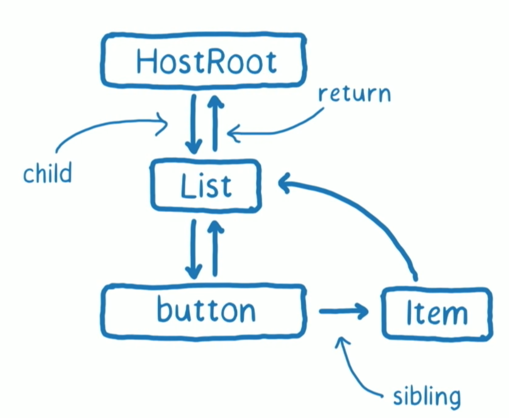
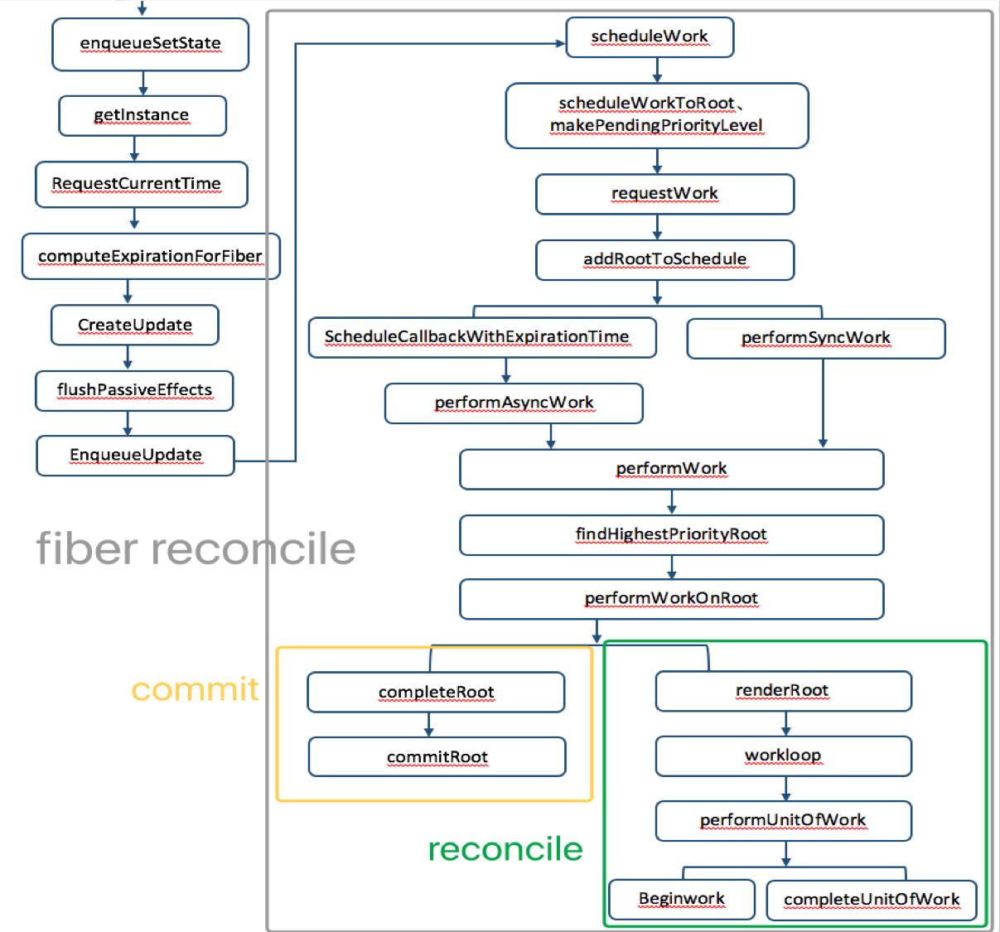

# react异步渲染
## 为什么要有异步渲染？
### react16之前的渲染：
  - 渲染流程：

    create element -> instance -> commit

    根据代码创建每个组件对应的element，根据reconciliation算法diff新旧节点树，不变的clone，更改的更新element，生成新的instance，操作真实的dom进行更新

  - 层级组件渲染顺序：

    例：A -> B -> C、D  
    生命周期执行顺序：A(constructor->willmount->render) -> B(constructor->willmount->render) -> C(constructor->willmount->render->didmount) -> D(constructor->willmount->render->didmount) -> B(didmount) -> A(didmount)  
    即：从顶层开始，以render为界限向下执行子组件渲染，直到最底层的自组件完成整个生命周期之后在逐层向上执行父组件的didmount
    
### 存在的问题：
  - 对于一个庞大的v-dom tree来说，diff算法执行的时间太长的情况下，主线程一直被js占用，任何的交互、渲染都会停止
  - 不是所有的数据更新都需要立即展示，比如屏幕显示之外的更新
  - 理想情况下，高优先级任务的处理应该可以打断低优先级的任务的处理，比如用户输入可打断部分数据更新

## 异步渲染优势以及原理
### 优势：良好的用户体验
### 原理：
  - fiber reconcile
  将任务拆分成一个个分片，每个分片执行完之后调用requestIdleCallback API检查是否还继续拥有主线程时间片，如果有继续下一个，如果没有则先处理其他高优先级事务，等主线程空闲下来继续执行，每个分片的数据结构即为fiber，在源码里对fiber的解释是“A Fiber is work on a Component that needs to be done or was done. There can be more than one per component”，即代表组件需要做的工作，一个组件对应一个或多个fiber节点。（react16之后的组件实例会生成一个_reactInternalFiber属性指向它对应的Fiber实例）
  - requestIdelCallback API
  requestIdleCallback 会让一个低优先级的任务在空闲期被调用，而 requestAnimationFrame 会让一个高优先级的任务在下一个栈帧被调用，从而保证了主线程按照优先级执行 fiber 单元。 优先级顺序为：文本框输入 > 本次调度结束需完成的任务 > 动画过渡 > 交互反馈 > 数据更新 > 不会显示但以防将来会显示的任务。

## Fiber
【**本章节贴的图来自Lin clark 视频演讲截图**】
### fiber节点数据结构

 

  <!-- ` -->

      Fiber = {
          tag: TypeOfWork, // fiber的类型，参考最后的tag类型
          alternate: Fiber|null, // 在fiber更新时克隆出的镜像fiber，对fiber的修改会标记在这个fiber上,相当于workInProgress
          return: Fiber|null, // 指向fiber树中的父节点
          child: Fiber|null, // 指向第一个子节点
          sibling: Fiber|null, // 指向兄弟节点
      }

### 渲染过程：以以下组件为例
  例：

  <!-- ` -->
      function Item({children}){
        return 
{children}

      }
      export default class App extends React.Component {
        constructor(props){
          super(props)
          this.state = {data:[1,2,3]}
        }
        square = () =>{
          this.setState((preState) => ({data:preState.data.map(v => v*v)}))
        }
        render(){
            return ([
            <button onClick={this.square}>平方</button>,
            ...this.state.data.map((el,idx) => <Item key={idx}>{el}</Item>)
            ])
        }
      }

      ReactDOM.render(
      < ConcurrentMode > 
        <App>
      </ConcurrentMode>
    , document.getElementById('root'));

  将整个渲染过程分为两个阶段：render/reconciliation和commit，前一个可中断，后一个不可中断

  

#### render/reconciliation
- update queue  
  **在react fiber中需传入一个函数，返回需更新的state**  
  this.setState((preState,props) => ({list:preState.list.map(el => el * el)})),将更新放入组件对应的update queue中
- scheduleWork
  1.更新组件优先级：scheduleWorkToRoot
  2.requestIdleCallback API 获取deadline：13ms
  3.进入workloop（追踪next unit of work: hostRoot和time remaining:12ms）
- workloop：

  + 追踪下一个工作单元（下一个待处理的fiber）和 当前还能占用主线程的时间，方便在计算和等待状态切换  
  1.当前fiber node，无更新，进入2，有更新，-> 3  
  2.clone当前节点至workInProgressTree,并给当前节点打上标签，进入-> 4  
  3.当前节点为叶子结点&&无兄弟节点 ？ 此节点改变产生的effect合并到父节点中。此时react会维护一个列表，其中记录所有产生effect的元素 ： 复制节点以及update queue，进入-> 4  
  4.检查时间片是否用完 && 有更高优先级任务 ？-> 5 ： ->6  
  5.执行更高有优先级任务  
  6.根据保存的下个工作单元的信息处理下个节点 -> 1 

  + 以本章开始举的例子为例，解释setState之后的流转：
  1.hostRoot无更新，clone至workInProgress-tree,连同list组件及其update queue  
  2.list插入后向父组件返回，根结点处理完成  
  3.检查时间片是否够用：time remaining:11.6ms,继续处理list  
  4.list的state更新了，根据调用render得到更新后的element，比较更新前后element的type值是否更改来决定fiber是否可以重用，在list中button、items都未更改，所以可以直接clone之前的fiber节点至workInProgress,同时给list打上标签，表示需要更新的节点  
  5.检查时间片是否够用：time remaining:10.1ms,继续处理button  
  6.当处理button的时候触发放大字体的任务，因为时间片还未用完，继续处理button，因为是叶子结点，所以直接返回，标记为完成  
  7.检查时间片是否够用：time remaining:8.9ms,继续处理item:1  
  8.通过shouldComponentUpdate检查是否需要更新，这里没有变，所以返回false，clone至workInProgress,处理完成  
  9.检查时间片是否够用：time remaining:4.5ms,继续处理item:2 -> item:4  
  10.通过shouldComponentUpdate检查是否需要更新，返回true，打上tag标签表示需要更新，clone至workInProgress  
  11.检查时间片是否够用：time remaining:1.4ms,继续处理div  
  12.item里的div是没有兄弟节点的叶子结点，且有更新，将更新放入effect list中，返回并merge到父节点  
  11.检查时间片是否够用：time remaining:0ms,处理放大字体的任务  
  13.放大字体任务处理之后继续处理item：3-> item:9(因为放大字体任务与react无关，所以可以接着上面的任务继续处理，若优先处理的任务与react相关，之前的处理便会被放弃，等有空闲的时候再从头处理)  
  14.item:3->item:9处理之后向上逐层返回，并merge effect list，所有节点标志完成，将workInProgress标记为pendingCommit,表示可以进入commit阶段，此时还是得检查时间够用与否，够用就进入commit阶段，用阶段1得出的effect list去更新dom，不够用就等有时间再更新  
  15.更新dom之后，current和workInProgress交换指针  

## 源码分析：  

- enqueueSetState:  

<!-- ` -->

    enqueueSetState(inst, payload, callback) {
      // 获取实例
      const fiber = getInstance(inst);
      // 当前时间
      const currentTime = requestCurrentTime();
      // 获取优先级
      const expirationTime = computeExpirationForFiber(currentTime, fiber);
      // 获取更新
      const update = createUpdate(expirationTime);
      update.payload = payload;
      if (callback !== undefined && callback !== null) {
        if (__DEV__) {
          warnOnInvalidCallback(callback, 'setState');
        }
        update.callback = callback;
      }
      flushPassiveEffects();
      // 添加更新
      enqueueUpdate(fiber, update);
      // fiber reconciliation
      scheduleWork(fiber, expirationTime);
    },

- scheduleWork:

<!-- ` -->

    function scheduleWork(fiber: Fiber, expirationTime: ExpirationTime) {
      // 更新优先级
      const root = scheduleWorkToRoot(fiber, expirationTime);
      // 如果这是个打断原有更新的任务，记录现有任务
      if (!isWorking && nextRenderExpirationTime !== NoWork && expirationTime > nextRenderExpirationTime) {
        interruptedBy = fiber;
        resetStack();
      }
      // 更新root的earliestPendingTime和latestPendingTime，同时调用findNextExpirationTimeToWorkOn设置下一个执行操作的时间  
      // nextExpirationTimeToWorkOn（即root中具有最高优先级的fiber的expirationTime）
      markPendingPriorityLevel(root, expirationTime);
      if ( !isWorking || isCommitting || nextRoot !== root) {
        const rootExpirationTime = root.expirationTime;
        // 每当根收到更新时，调度程序都会调用requestWork。 渲染器可以在将来的某个时刻调用renderRoot。
        // requestwork-> performWorkOnRoot -> renderroot -> workloop
        requestWork(root, rootExpirationTime);
      }
    }

- requestWork

<!-- ` -->

    function requestWork(root: FiberRoot, expirationTime: ExpirationTime) {
      // 把当前的更新添加到schedule list中
      addRootToSchedule(root, expirationTime);
      if (isRendering) {
        // Prevent reentrancy. Remaining work will be scheduled at the end of
        // the currently rendering batch.
        return;
      }
      if (isBatchingUpdates) {
        // Flush work at the end of the batch.
        if (isUnbatchingUpdates) {
          // ...unless we're inside unbatchedUpdates, in which case we should
          // flush it now.
          nextFlushedRoot = root;
          nextFlushedExpirationTime = Sync;
          performWorkOnRoot(root, Sync, false);
        }
        return;
      }
  
      if (expirationTime === Sync) {
        // 同步
        performSyncWork();
      } else {
        // 异步
        scheduleCallbackWithExpirationTime(root, expirationTime);
      }
    }

- scheduleCallbackWithExpirationTime

<!-- ` -->

    function scheduleCallbackWithExpirationTime(
      root: FiberRoot,
      expirationTime: ExpirationTime,
    ) {
      if (callbackExpirationTime !== NoWork) {
        // A callback is already scheduled. Check its expiration time (timeout).
        if (expirationTime < callbackExpirationTime) {
          // Existing callback has sufficient timeout. Exit.
          return;
        } else {
          if (callbackID !== null) {
            // Existing callback has insufficient timeout. Cancel and schedule a
            // new one.
            cancelDeferredCallback(callbackID);
          }
        }
        // The request callback timer is already running. Don't start a new one.
      } else {
        startRequestCallbackTimer();
      }
      callbackExpirationTime = expirationTime;
      const currentMs = now() - originalStartTimeMs;
      const expirationTimeMs = expirationTimeToMs(expirationTime);
      const timeout = expirationTimeMs - currentMs;
      // chrome等览器中使用requestIdleCallback API，没有这个API的浏览器中，通过requestAnimationFrame模拟一个requestIdleCallback
      callbackID = scheduleDeferredCallback(performAsyncWork, {timeout});
    }
  
- performAsyncWork/performSyncWork -> performWork -> performWorkOnRoot
- performWorkOnRoot - Reconciliation Phase  
<!-- ` -->

    function workLoop(isYieldy) {
      if (!isYieldy) {
        // 未超时
        while (nextUnitOfWork !== null) {
          nextUnitOfWork = performUnitOfWork(nextUnitOfWork);
        }
      } else {
        // 超时
        while (nextUnitOfWork !== null && !shouldYieldToRenderer()) {
          nextUnitOfWork = performUnitOfWork(nextUnitOfWork);
        }
      }
    }
- performWorkOnRoot - commit Phase  
  ...Unfinished, to be continued

## 补充资料：
- tag:

<!-- ` -->

    export const FunctionComponent = 0; 
    export const ClassComponent = 1;
    export const IndeterminateComponent = 2; // Before we know whether it is function or class
    export const HostRoot = 3; // Root of a host tree. Could be nested inside another node.
    export const HostPortal = 4; // A subtree. Could be an entry point to a different renderer.
    export const HostComponent = 5;
    export const HostText = 6;
    export const Fragment = 7;
    export const Mode = 8;
    export const ContextConsumer = 9;
    export const ContextProvider = 10;
    export const ForwardRef = 11;
    export const Profiler = 12;
    export const SuspenseComponent = 13;
    export const MemoComponent = 14;
    export const SimpleMemoComponent = 15;
    export const LazyComponent = 16;
    export const IncompleteClassComponent = 17;

- 优先级-react-v15.6
<!-- ` -->

    module.exports = {
      NoWork: 0, // No work is pending.
      SynchronousPriority: 1, // For controlled text inputs. Synchronous side-effects.
      AnimationPriority: 2, // Needs to complete before the next frame.
      HighPriority: 3, // Interaction that needs to complete pretty soon to feel responsive.
      LowPriority: 4, // Data fetching, or result from updating stores.
      OffscreenPriority: 5, // Won't be visible but do the work in case it becomes visible.
    }

## 参考文献
[react fiber - 妖僧风月](https://juejin.im/post/5ab7b3a2f265da2378403e57)  
[A Cartoon Intro to Fiber - ](https://www.youtube.com/watch?v=ZCuYPiUIONs)  
[requestIdleCallback-后台任务调度](http://www.zhangyunling.com/702.html)  
[React-从源码分析React Fiber工作原理](https://blog.csdn.net/qiqingjin/article/details/80118669)  
